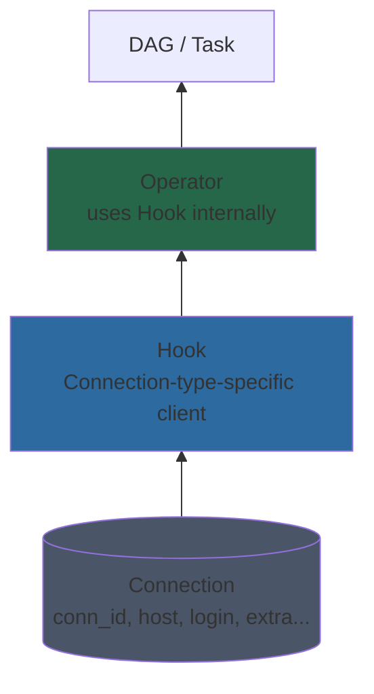

# Connections, Hooks, and Providers

## Layered Abstraction



- **Connection** — credential and endpoint config stored centrally (DB, env var, or secrets manager)
- **Hook** — a Python class that reads a Connection and returns a typed client (`SparkHook`, `TrinoHook`, `S3Hook`)
- **Operator** — calls the Hook; the DAG author only specifies `conn_id`

---

## Connection Anatomy

A Connection record has these fields:

| Field | Purpose | Example |
|---|---|---|
| `conn_id` | Unique identifier referenced in DAGs | `spark_default` |
| `conn_type` | Determines which Hook class to use | `spark`, `trino`, `aws` |
| `host` | Hostname or IP | `spark-master` |
| `port` | Port number | `7077` |
| `schema` | Database/catalog name | `lakehouse` |
| `login` | Username | `trino` |
| `password` | Credential (encrypted at rest with Fernet key) | `*****` |
| `extra` | JSON dict for provider-specific config | `{"endpoint_url": "http://rustfs:9000"}` |

---

## Connection Storage

### Environment Variables (this project's approach)

The URI format encodes all fields in a single env var:
```
AIRFLOW_CONN_{CONN_ID_UPPERCASE}=<conn_type>://<login>:<password>@<host>:<port>/<schema>?<extra>
```

From `services/airflow/docker-compose.yml`:

```bash
# Spark — conn_type=spark, host=spark-master, port=7077
AIRFLOW_CONN_SPARK_DEFAULT: spark://spark-master:7077

# Trino — conn_type=trino, host=trino, port=8080
# The login portion is required: Trino rejects requests without an
# X-Trino-User header even when auth is off.
AIRFLOW_CONN_TRINO_DEFAULT: trino://airflow@trino:8080/

# RustFS (S3-compatible) — conn_type=aws, extra includes endpoint_url
AIRFLOW_CONN_AWS_DEFAULT: "aws://?endpoint_url=http%3A%2F%2Frustfs%3A9000\
  &region_name=us-east-1\
  &aws_access_key_id=${RUSTFS_ACCESS_KEY:-rustfsadmin}\
  &aws_secret_access_key=${RUSTFS_SECRET_KEY:-rustfsadmin123}"
```

Env-var connections cannot be edited via the UI and are not stored in the metadata DB. They are the most secure option for static infrastructure credentials.

### Metadata DB (UI-managed)

Created via UI (`Admin → Connections`) or CLI:
```bash
airflow connections add 'nessie_default' \
  --conn-type 'http' \
  --conn-host 'nessie' \
  --conn-port '19120' \
  --conn-schema '/iceberg/v1'
```

Or via REST API:
```bash
# This project sets AIRFLOW__CORE__AUTH_MANAGER to FabAuthManager
# (services/airflow/docker-compose.yml), so HTTP basic auth works.
# With the default SimpleAuthManager you'd need a JWT — see "API auth" below.
curl -u admin:airflow \
  -X POST http://localhost:8082/api/v2/connections \
  -H "Content-Type: application/json" \
  -d '{
    "connection_id": "nessie_default",
    "conn_type": "http",
    "host": "nessie",
    "port": 19120,
    "schema": "/iceberg/v1"
  }'
```

Values are encrypted at rest using the Fernet key (`AIRFLOW__CORE__FERNET_KEY`). Without a Fernet key Airflow refuses to encrypt new credentials and cannot decrypt existing ones — it logs a warning and stores the value unencrypted. The `.env` in this repo leaves `AIRFLOW_FERNET_KEY` blank, which is acceptable for dev (warnings only, ephemeral credentials) but unacceptable for production.

### API auth

Airflow 3.x ships with `SimpleAuthManager` by default, which exposes JWT-only auth on `/api/v2/`. This project explicitly sets `AIRFLOW__CORE__AUTH_MANAGER` to `FabAuthManager` (the Flask AppBuilder manager from the `fab` provider), which restores HTTP basic auth. That's why every `curl -u admin:airflow ...` example in these docs works directly. If you swap to `SimpleAuthManager`, you'll need to acquire a JWT first and send `Authorization: Bearer <token>` on each request.

### Secrets Backends

For production, delegate connection and variable storage to an external secrets manager. Airflow checks these in order: secrets backend → env var → metadata DB. **Precedence implication:** an env-var connection silently overrides a UI-edited connection with the same `conn_id`, leading to "I changed it in the UI and nothing happened" debugging. Lookup is one-way — there is no merge.

```ini
# airflow.cfg
[secrets]
backend = airflow.providers.amazon.aws.secrets.secrets_manager.SecretsManagerBackend
backend_kwargs = {
  "connections_prefix": "airflow/connections",
  "variables_prefix": "airflow/variables",
  "region_name": "us-east-1"
}
```

With HashiCorp Vault:
```ini
backend = airflow.providers.hashicorp.secrets.vault.VaultBackend
backend_kwargs = {"connections_path": "connections", "variables_path": "variables", "mount_point": "airflow"}
```

---

## This Project's Pre-Wired Connections

### `spark_default`

| Field | Value |
|---|---|
| conn_type | `spark` |
| host | `spark-master` |
| port | `7077` |
| Schema | (none) |
| Provider | `apache-airflow-providers-apache-spark` |

Used by `SparkSubmitOperator`:
```python
SparkSubmitOperator(conn_id="spark_default", application="job.py", ...)
```

### `trino_default`

| Field | Value |
|---|---|
| conn_type | `trino` |
| host | `trino` |
| port | `8080` |
| login | `airflow` (required — Trino rejects requests without `X-Trino-User`) |
| Schema | (none, specified per-query) |
| Provider | `apache-airflow-providers-trino` |

Used by `TrinoOperator` or `SQLExecuteQueryOperator`:
```python
SQLExecuteQueryOperator(conn_id="trino_default", sql="SELECT ...", ...)
```

### `aws_default`

| Field | Value |
|---|---|
| conn_type | `aws` |
| endpoint_url | `http://rustfs:9000` |
| region_name | `us-east-1` |
| aws_access_key_id | `${RUSTFS_ACCESS_KEY}` |
| aws_secret_access_key | `${RUSTFS_SECRET_KEY}` |
| Provider | `apache-airflow-providers-amazon` |

The `endpoint_url` override redirects all AWS SDK calls to RustFS instead of real AWS. This is the standard pattern for S3-compatible storage.

Used by any Amazon provider operator:
```python
S3KeySensor(bucket_name="lakehouse", bucket_key="raw/events/_SUCCESS", aws_conn_id="aws_default")
S3CreateObjectOperator(s3_bucket="lakehouse", s3_key="...", aws_conn_id="aws_default")
```

---

## Hooks

Hooks are the reusable connection layer. Every provider ships Hooks that operators call internally. You can also use Hooks directly in `PythonOperator` callables when you need fine-grained control.

### SparkHook

```python
from airflow.providers.apache.spark.hooks.spark_connect import SparkConnectHook

def run_custom_spark(**context):
    hook = SparkConnectHook(conn_id="spark_default")
    spark = hook.get_conn()
    df = spark.sql("SELECT count(*) FROM iceberg.lakehouse.events")
    return df.collect()[0][0]
```

### TrinoHook

```python
from airflow.providers.trino.hooks.trino import TrinoHook

def query_trino(**context):
    hook = TrinoHook(trino_conn_id="trino_default")
    rows = hook.get_records("SELECT snapshot_id FROM iceberg.lakehouse.events$snapshots LIMIT 1")
    return rows[0][0]
```

### S3Hook (pointing to RustFS)

```python
from airflow.providers.amazon.aws.hooks.s3 import S3Hook

def check_landing_zone(**context):
    hook = S3Hook(aws_conn_id="aws_default")
    keys = hook.list_keys(bucket_name="lakehouse", prefix=f"raw/events/dt={context['ds']}/")
    return len(keys) > 0
```

---

## Provider Packages

Connections and Hooks are distributed as **provider packages** — optional pip packages that add integrations to the core Airflow image.

| Provider | Package | Adds |
|---|---|---|
| Apache Spark | `apache-airflow-providers-apache-spark` | SparkSubmitOperator, SparkHook |
| Trino | `apache-airflow-providers-trino` | TrinoOperator, TrinoHook |
| Amazon AWS | `apache-airflow-providers-amazon` | S3 operators/sensors, SecretsManager, EMR, etc. |
| HTTP | `apache-airflow-providers-http` | SimpleHttpOperator, HttpSensor |
| Postgres | `apache-airflow-providers-postgres` | PostgresOperator, PostgresHook |
| Common SQL | `apache-airflow-providers-common-sql` | SQLExecuteQueryOperator (DB-agnostic) |

The base `apache/airflow:3.2.1` image bundles a large default set (amazon, common-sql, fab, http, postgres, redis, standard, …) but **does not include** `apache-spark` or `trino`. This project extends the image at [services/airflow/Dockerfile](../../services/airflow/Dockerfile) and pins both against the official constraint file for Airflow 3.2.1 / Python 3.13, so provider versions resolve cleanly with the core. Run `airflow providers list` inside any container to see the exact resolved set.

---

## Testing Connections

Connection testing is **disabled by default in Airflow 3.x** (`[core] test_connection = Disabled`). Enable it explicitly before the calls below will succeed:

```yaml
# services/airflow/docker-compose.yml — under environment:
AIRFLOW__CORE__TEST_CONNECTION: "Enabled"
```

Then via CLI:
```bash
# Service names are stable; container names are project-prefixed by compose,
# so prefer `docker compose exec` over `docker exec <hardcoded-name>`.
docker compose -f docker-compose.local.yml exec airflow-scheduler \
  airflow connections test spark_default
```

Via REST API:
```bash
# FabAuthManager is set in this project — basic auth works directly.
curl -u admin:airflow \
  -X POST http://localhost:8082/api/v2/connections/spark_default/test
```

---

## Connection Security Checklist

- Always set `AIRFLOW__CORE__FERNET_KEY` in prod — without it, the metadata DB stores credentials unencrypted and a Fernet rotation cannot decrypt them.
- Use env-var connections for static infrastructure (Spark, Trino, RustFS) — they never touch the DB.
- Use a secrets backend (Vault, AWS Secrets Manager) for rotating credentials.
- Rotate `RUSTFS_ACCESS_KEY` and `RUSTFS_SECRET_KEY` in `.env` — all three pre-wired connections inherit these.
- Do not commit `.env` with real credentials; use `.env.example` with placeholder values in the repo.

## Lifecycle gotchas

- **`AIRFLOW_CONN_*` env vars are read at process startup.** Adding or changing one on a running worker has no effect until the container is restarted.
- **Special characters must be percent-encoded** in the URI form. The `aws_default` example above uses `http%3A%2F%2Frustfs%3A9000` for the endpoint URL because `:` and `/` are URI-significant. Passwords with `@`, `:`, `/`, `%`, etc. must be encoded too.
- **Secrets-backend lookups happen on every connection access.** A misconfigured backend can throttle every task. Test the backend in isolation before flipping the env var on.
