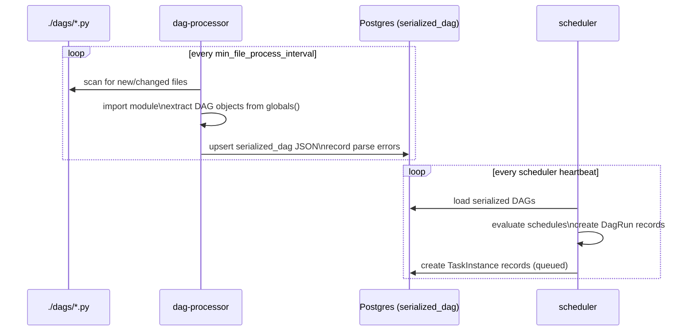

# DAGs — Directed Acyclic Graphs

A DAG is the core abstraction in Airflow: a Python object that defines a workflow as a graph of tasks with directed dependencies and no cycles. Airflow does not execute arbitrary code — it executes the DAG's task graph according to a schedule and dependency rules.

---

## DAG Parse Cycle



The dag-processor and scheduler are **decoupled in Airflow 3.x**. A DAG parse error cannot crash the scheduler; it simply records the error in the DB and the UI surfaces it per-file.

---

## DAG Anatomy

```python
from datetime import datetime, timedelta
from airflow.sdk import DAG
from airflow.providers.standard.operators.python import PythonOperator

with DAG(
    dag_id="ingest_iceberg_snapshot",
    schedule="0 6 * * *",            # Airflow 3.x: `schedule_interval` was REMOVED — use `schedule`
    start_date=datetime(2025, 1, 1),
    catchup=False,
    max_active_runs=1,
    default_args={
        "retries": 2,
        "retry_delay": timedelta(minutes=5),
        "execution_timeout": timedelta(hours=1),
    },
    tags=["iceberg", "ingest"],
    description="Daily Iceberg snapshot ingest via Trino",
) as dag:
    ...
```

The classic `from airflow import DAG` import still works as a back-compat shim, but `airflow.sdk` is the canonical 3.x location (it lives in the separately installable Task SDK package and is the import used by the new Task Execution API).

### Core Parameters

| Parameter | Type | Purpose |
|---|---|---|
| `dag_id` | `str` | Unique identifier — must be unique across all DAG files |
| `schedule` | `str \| timedelta \| Dataset \| None` | When to trigger (cron, interval, dataset event, or manual-only) |
| `start_date` | `datetime` | Earliest logical date for scheduling (timezone-aware preferred) |
| `catchup` | `bool` | Whether to backfill missed runs since `start_date` — default `True`, usually set `False` |
| `max_active_runs` | `int` | Concurrent DagRun cap — use `1` for DAGs that mutate shared state |
| `max_active_tasks` | `int` | Concurrent task instances per DagRun |
| `default_args` | `dict` | Defaults for all operators in this DAG (retries, owner, etc.) |
| `tags` | `list[str]` | UI filtering labels |
| `on_failure_callback` | `callable` | DAG-level failure hook (alerting, PagerDuty, etc.) |
| `params` | `dict` | Typed DAG-level parameters, accessible at runtime |

---

## Scheduling

### Cron Expressions

```python
schedule="0 6 * * *"        # 06:00 UTC daily
schedule="*/15 * * * *"     # every 15 minutes
schedule="0 0 * * MON"      # weekly on Monday
```

Airflow uses the concept of **data intervals**: a DAG run with `logical_date=2025-01-01` represents the interval `[2025-01-01, 2025-01-02)`. The run is triggered **after** the interval ends.

### Preset Schedules

| Preset | Equivalent cron |
|---|---|
| `@once` | Run exactly once |
| `@hourly` | `0 * * * *` |
| `@daily` | `0 0 * * *` |
| `@weekly` | `0 0 * * 0` |
| `@monthly` | `0 0 1 * *` |
| `None` | Manual trigger only |

### timedelta Schedule

```python
from datetime import timedelta
schedule=timedelta(hours=6)
```

Creates runs at a fixed interval from `start_date`. Unlike cron, this is not aligned to clock boundaries.

### Asset-Triggered Schedule

```python
from airflow.sdk import Asset, AssetAll, AssetAny

raw_events = Asset("s3://lakehouse/raw/events/")

# Producer DAG — marks the asset as updated after completion
with DAG("produce_events", schedule="@daily") as dag:
    write_task = PythonOperator(
        task_id="write_events",
        python_callable=write_to_s3,
        outlets=[raw_events],    # signals this task produces the asset
    )

# Consumer DAG — triggered automatically when raw_events is updated
with DAG("consume_events", schedule=[raw_events]) as dag:
    ...

# Multi-input: AssetAll = fire when ALL inputs updated since last run;
# AssetAny = fire when ANY does. The bare list form (`schedule=[a, b]`)
# is equivalent to AssetAny.
with DAG("consume_both",
         schedule=AssetAll(raw_events, Asset("s3://lakehouse/clean/users/"))) as dag:
    ...
```

Assets decouple producer and consumer DAGs without polling. The scheduler tracks update events in the metadata DB.

> **3.x rename:** `Dataset` was renamed to `Asset` in Airflow 3.0 (AIP-74/75). The `Dataset` back-compat alias is **not present** in the `airflow.sdk` shipped with the 3.2.1 image this project runs — use `Asset` directly.

For a runnable example, see [services/airflow/dags/lakehouse_smoke.py](../../services/airflow/dags/lakehouse_smoke.py).

---

## DAG Runs and Logical Dates

Each **DagRun** has:
- `run_id` — unique identifier (e.g., `scheduled__2025-01-01T06:00:00+00:00`)
- `logical_date` — the data interval start (previously called `execution_date` in 2.x; the `execution_date` key has been **removed** from the task context in 3.x — accessing it raises)
- `data_interval_start` / `data_interval_end` — explicit interval bounds
- `run_type` — `scheduled`, `manual`, `asset_triggered`, `backfill`
- `state` — `running`, `success`, `failed`

Access in tasks via the context dict or Jinja templates:
```python
def my_task(**context):
    logical_date = context["logical_date"]
    data_interval_start = context["data_interval_start"]
    data_interval_end = context["data_interval_end"]
```

```python
# Jinja template in SQL operators
sql = "SELECT * FROM events WHERE dt = '{{ ds }}'"  # ds = logical_date as YYYY-MM-DD
```

### Common Jinja Variables

| Variable | Value |
|---|---|
| `{{ ds }}` | `logical_date` as `YYYY-MM-DD` |
| `{{ ts }}` | ISO 8601 timestamp |
| `{{ data_interval_start }}` | Start of data interval |
| `{{ data_interval_end }}` | End of data interval |
| `{{ dag.dag_id }}` | DAG identifier |
| `{{ run_id }}` | DagRun run_id |
| `{{ params.key }}` | DAG params value |

---

## Catchup and Backfill

### catchup=True (default)

When a DAG with `start_date=2025-01-01` and `schedule="@daily"` is unpaused today, Airflow creates **one DagRun for every missed interval**. For a year-old DAG this means 365 runs queued instantly.

```python
# Almost always set this unless backfilling is intentional
catchup=False
```

### Programmatic Backfill (Airflow 3.x)

```bash
airflow dags backfill \
  --start-date 2025-01-01 \
  --end-date 2025-01-07 \
  ingest_iceberg_snapshot
```

Or via the REST API (Airflow 3.x):
```bash
# This project uses FabAuthManager (see services/airflow/docker-compose.yml),
# so basic auth works directly. With the default SimpleAuthManager you'd need
# to obtain a JWT first — see docs/airflow/connections.md.
curl -u admin:airflow \
  -X POST http://localhost:8082/api/v2/dags/ingest_iceberg_snapshot/dagRuns \
  -H "Content-Type: application/json" \
  -d '{"logical_date": "2025-01-01T00:00:00Z"}'
```

---

## Dynamic Task Mapping

For most "I need N similar tasks" problems, prefer mapping over generating N DAGs:

```python
from airflow.sdk import task

@task
def process(partition: str) -> int:
    return count_rows(partition)

@task
def aggregate(counts: list[int]) -> int:
    return sum(counts)

partitions = ["dt=2025-01-01", "dt=2025-01-02", "dt=2025-01-03"]
aggregate(process.expand(partition=partitions))
```

- `.expand(arg=[...])` creates one mapped task instance per element.
- `.expand_kwargs([{...}, {...}])` maps over full kwarg dicts when args differ.
- `.partial(fixed=...)` pins arguments that are constant across instances.

The mapping cardinality is resolved at runtime (from upstream XCom output or `.expand_kwargs`), not at parse time.

---

## Dynamic DAGs

### Factory Pattern

```python
from airflow.sdk import DAG
from airflow.providers.standard.operators.python import PythonOperator

TABLES = ["events", "users", "sessions"]

for table in TABLES:
    with DAG(
        dag_id=f"ingest_{table}",
        schedule="@daily",
        start_date=datetime(2025, 1, 1),
        catchup=False,
    ) as dag:
        PythonOperator(
            task_id="ingest",
            python_callable=ingest_table,
            op_kwargs={"table": table},
        )
    globals()[f"ingest_{table}"] = dag  # must expose to module globals
```

Each iteration creates a separate DAG object. The dag-processor finds them by scanning `globals()` for objects of type `DAG`.

### Parameterized DAGs

```python
from airflow.sdk import DAG, Param

with DAG(
    dag_id="parameterized_ingest",
    schedule=None,
    params={
        "table": Param("events", type="string", description="Target Iceberg table"),
        "partition": Param("dt=2025-01-01", type="string"),
    },
) as dag:
    ...
```

Params are passed at trigger time via UI or API:
```bash
curl -u admin:airflow \
  -X POST http://localhost:8082/api/v2/dags/parameterized_ingest/dagRuns \
  -H "Content-Type: application/json" \
  -d '{"conf": {"table": "users", "partition": "dt=2025-02-01"}}'
```

`Param` schemas are validated at **trigger time**, not at parse time — a bad type in `params` will not fail at DAG import.

---

## DAG Versioning (Airflow 3.x)

Airflow 3.x introduces explicit DAG versioning. When the dag-processor detects a structural change to a DAG (task graph change, schedule change), it creates a new **DAG version** record. Historical DagRuns reference the version they were created under.

This is a departure from 2.x where every parse overwrote the single DAG record, making it impossible to correlate old runs to the graph structure they executed against.

---

## Best Practices

**Idempotency** — every task should produce the same result when re-run for the same logical date. Use `INSERT OVERWRITE` in Spark/Trino rather than append-only writes. In Iceberg, prefer snapshot-based rewrites over appends for daily ETL.

**`catchup=False`** — set this on all DAGs unless you have explicit backfill requirements. Accidental unpauses with `catchup=True` can flood the executor.

**`max_active_runs=1`** — for DAGs that mutate shared tables or Iceberg partitions. Concurrent runs on overlapping data intervals will corrupt results.

**`start_date` as a static datetime** — never use `datetime.now()` as `start_date`. It shifts on every parse, confusing the scheduler.

**Short top-level module code** — the dag-processor imports your DAG file on every scan. Keep module-level code (DB connections, HTTP calls) out of the top level; put it inside `execute()` methods.

**One DAG per file** (or a few related ones) — large files with dozens of DAGs slow down the dag-processor and make debugging harder.

**Mind the parse timeout** — `[core] dagbag_import_timeout` (default 30 s) kills DAG file imports that take too long. If you do heavy imports or network calls at module level you'll hit it.

---

## Reference DAG

The runnable smoke-test DAGs in [services/airflow/dags/lakehouse_smoke.py](../../services/airflow/dags/lakehouse_smoke.py) exercise the patterns covered above: TaskFlow `@task`, asset-based DAG-to-DAG triggering (producer outlets, consumer scheduled on the asset), and connections to the lakehouse services (Trino + RustFS via the pre-wired conn_ids). Trigger `lakehouse_smoke_producer` manually; `lakehouse_smoke_consumer` should fire automatically when the asset is updated.
