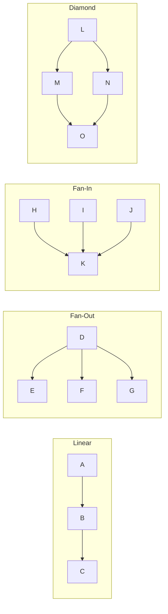
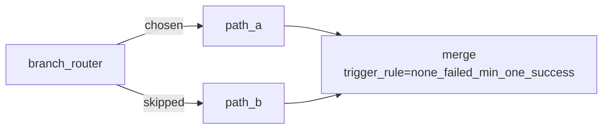

# Task Dependencies

Dependencies define the execution order of tasks within a DAG. Airflow evaluates the dependency graph on every scheduler heartbeat and promotes tasks to `scheduled` state when all required upstream conditions are met.

---

## Dependency Syntax

### Bitshift Operators (idiomatic)

```python
# >> means "must run before"
extract >> transform >> load

# << means "must run after"
load << transform << extract

# Equivalent to both
extract.set_downstream(transform)
transform.set_downstream(load)
```

### Fan-Out and Fan-In

```python
# Fan-out: extract must complete before both transform tasks
extract >> [transform_events, transform_users]

# Fan-in: both transforms must complete before load
[transform_events, transform_users] >> load

# Diamond pattern
extract >> [transform_events, transform_users] >> load
```

---

## Dependency Patterns



---

## TriggerRule

By default, a task only runs when **all direct upstream tasks succeed** (`all_success`). `TriggerRule` overrides this behavior per task.

```python
from airflow.utils.trigger_rule import TriggerRule

cleanup = PythonOperator(
    task_id="cleanup",
    python_callable=cleanup_fn,
    trigger_rule=TriggerRule.ALL_DONE,  # runs regardless of upstream outcome
)
```

### TriggerRule Reference

| Rule | Triggers when... | Typical use case |
|---|---|---|
| `all_success` | All upstreams succeeded | Default — normal pipeline progression |
| `all_failed` | All upstreams failed | Fallback/error path |
| `all_done` | All upstreams finished (any state) | Cleanup/teardown regardless of outcome |
| `all_skipped` | All upstreams were skipped | Rarely needed |
| `one_success` | At least one upstream succeeded | Parallel probes, first-result wins |
| `one_failed` | At least one upstream failed | Alerting on partial failure |
| `one_done` | At least one upstream finished | Streaming first-complete pattern |
| `none_failed` | No upstream failed (success or skip OK) | Works with branch paths |
| `none_failed_min_one_success` | No failures AND at least one success | Branch + merge points |
| `none_skipped` | No upstream was skipped | All paths must have run |
| `always` | Unconditional | Setup/teardown that must always run |

### The `none_failed` Trap with Branching

When using `BranchOperator`, non-selected branches are `skipped`. The default `all_success` on the merge task causes it to be `upstream_failed` (because skipped != success). Use `none_failed_min_one_success` at merge points:



```python
from airflow.providers.standard.operators.python import BranchPythonOperator

def choose_path(**context):
    if context["params"].get("env") == "prod":
        return "path_a"
    return "path_b"

branch = BranchPythonOperator(
    task_id="branch_router",
    python_callable=choose_path,
)

path_a = EmptyOperator(task_id="path_a")
path_b = EmptyOperator(task_id="path_b")
merge  = EmptyOperator(
    task_id="merge",
    trigger_rule=TriggerRule.NONE_FAILED_MIN_ONE_SUCCESS,
)

branch >> [path_a, path_b] >> merge
```

---

## TaskFlow Branch

With the `@task.branch` decorator, the function returns the `task_id` (or list of `task_id`s) to execute next. All others in the downstream set are skipped.

```python
from airflow.sdk import task

@task.branch
def route_by_size(row_count: int) -> str:
    if row_count > 1_000_000:
        return "run_spark_job"
    return "run_python_job"

@task
def run_spark_job(): ...

@task
def run_python_job(): ...

@task(trigger_rule=TriggerRule.NONE_FAILED_MIN_ONE_SUCCESS)
def notify(): ...

count = get_row_count()
branch = route_by_size(count)
spark = run_spark_job()
python = run_python_job()
done = notify()

branch >> [spark, python] >> done
```

---

## ShortCircuitOperator

Stops the entire downstream branch when a condition is `False`. All downstream tasks enter `skipped` state.

```python
from airflow.providers.standard.operators.python import ShortCircuitOperator

def has_new_data(**context) -> bool:
    # Returns False if no new files landed since last run
    return check_s3_for_new_files(context["ds"])

guard = ShortCircuitOperator(
    task_id="guard_new_data",
    python_callable=has_new_data,
    ignore_downstream_trigger_rules=True,  # skip ALL downstream, not just direct
)

guard >> transform >> load
```

`ignore_downstream_trigger_rules=True` (default) ensures all downstream tasks skip even if they have `TriggerRule.ALL_DONE`. Set to `False` if you want teardown tasks with `ALL_DONE` to still run.

---

## Asset Dependencies (Airflow 3.x)

Assets provide **DAG-to-DAG dependencies** based on data availability rather than time schedules. A DAG declares that it produces assets (via `outlets`); another DAG schedules itself to run when those assets are updated (via `schedule=[asset]` for OR semantics, or `AssetAll(...)` / `AssetAny(...)` for explicit AND / OR).

> Renamed from `Dataset` in Airflow 3.0 (AIP-74/75). The `Dataset` back-compat alias is **not present** in the `airflow.sdk` shipped with this cluster — use `Asset` directly.

```mermaid
graph LR
    subgraph prod["Producer DAG (scheduled @daily)"]
        W[write_events\noutlets=[raw_events]]
    end

    subgraph cons["Consumer DAG (asset-triggered)"]
        R[read_events]
    end

    W -->|updates asset| DS[(raw_events\ns3://lakehouse/raw/events/)]
    DS -->|triggers| R
```

```python
from airflow.sdk import DAG, Asset, AssetAll
from airflow.providers.standard.operators.python import PythonOperator

raw_events = Asset("s3://lakehouse/raw/events/")
clean_events = Asset("s3://lakehouse/clean/events/")
processed_users = Asset("s3://lakehouse/clean/users/")

# Producer
with DAG("produce_raw", schedule="@daily", ...) as dag:
    PythonOperator(
        task_id="write_raw",
        python_callable=write_raw_events,
        outlets=[raw_events],
    )

# Single-input consumer — fires when raw_events is updated
with DAG("transform_events", schedule=[raw_events], ...) as dag:
    PythonOperator(
        task_id="transform",
        python_callable=transform_events,
        outlets=[clean_events],  # this DAG also produces an asset
    )

# Multi-input consumer — fires only when BOTH inputs have been updated since
# the last consumer run. Use AssetAny(...) for OR semantics instead.
with DAG("join_events_users",
         schedule=AssetAll(clean_events, processed_users), ...) as dag:
    ...
```

Assets are identified by URI strings — the string is the identity. Airflow does not validate that the URI actually exists or that data was written to it; it only tracks that a task with a matching `outlets` entry completed successfully. Two URIs that look equivalent to a human (different trailing slash, scheme casing) register as distinct assets, so be consistent.

Events queue while a consumer DAG is paused: on unpause, the consumer fires for the queued events (which may be many — common source of "why did 12 DagRuns just spawn" tickets).

For a runnable example, see [services/airflow/dags/lakehouse_smoke.py](../../services/airflow/dags/lakehouse_smoke.py) which wires `lakehouse_smoke_producer` to `lakehouse_smoke_consumer` through an asset on `s3://lakehouse/airflow/_smoke`.

---

## `depends_on_past`

When `depends_on_past=True`, a task will not run unless the **same task in the previous DagRun** succeeded. This is useful for stateful operations where each run builds on the previous one.

```python
incremental_load = PythonOperator(
    task_id="incremental_load",
    python_callable=load_incremental,
    depends_on_past=True,   # blocks if yesterday's run failed
)
```

`depends_on_past=True` only sequences the same `task_id` across runs — it does **not** serialize concurrent DagRuns end-to-end. If you need that, also set `max_active_runs=1` on the DAG. With `depends_on_past=True` and `catchup=True`, backfill runs execute sequentially, which can take much longer than expected.

---

## ExternalTaskSensor

Waits for a task in a **different DAG** to complete. Used to express cross-DAG dependencies without the Asset model.

```python
from airflow.providers.standard.sensors.external_task import ExternalTaskSensor

wait_for_upstream = ExternalTaskSensor(
    task_id="wait_for_upstream",
    external_dag_id="produce_raw",
    external_task_id="write_raw",     # None = wait for entire DagRun
    allowed_states=["success"],
    mode="reschedule",                # release the worker slot between pokes
    timeout=3600,
)
```

Default `mode="poke"` holds a worker slot for the entire wait, which is wasteful on long waits. `mode="reschedule"` frees the slot between pokes. For a fully async wait that uses near-zero resources, use a deferrable sensor (see [operators-tasks.md](operators-tasks.md#deferrable-mode-airflow-22)).

Prefer the Asset model over `ExternalTaskSensor` for new DAGs — it expresses intent more clearly and the UI surfaces lineage automatically.

---

## TriggerDagRunOperator

Procedural alternative when you need an upstream DAG to actively kick off a downstream DAG (parent passes `conf`, e.g.) rather than the downstream waiting/listening.

```python
from airflow.providers.standard.operators.trigger_dagrun import TriggerDagRunOperator

trigger = TriggerDagRunOperator(
    task_id="trigger_downstream",
    trigger_dag_id="downstream_dag",
    conf={"upstream_run_id": "{{ run_id }}"},
    wait_for_completion=False,     # set True if you want the parent to block
)
```

Three patterns for DAG-to-DAG coupling, in rough order of preference:
1. **Asset** — declarative, surfaces lineage, decouples producer/consumer schedules.
2. **TriggerDagRunOperator** — procedural, useful when you must pass `conf`.
3. **ExternalTaskSensor** — polling, slowest, last resort when you can't change the upstream.
