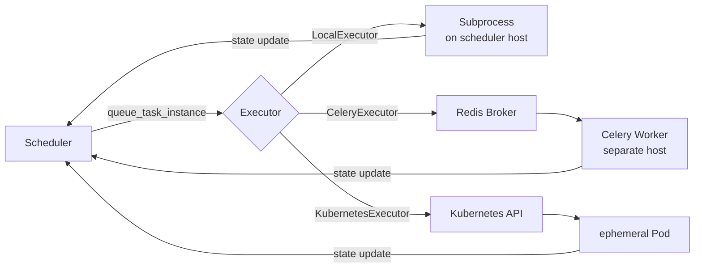
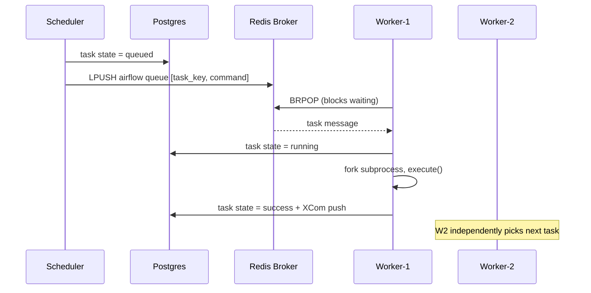
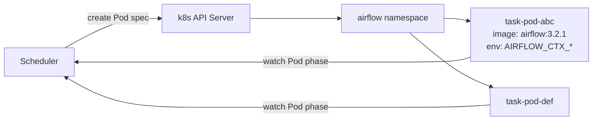

# Airflow Executors

An executor is the mechanism by which Airflow dispatches task instances to compute resources. The executor is configured globally and determines the parallelism model, resource isolation, and operational complexity of your deployment.

```
AIRFLOW__CORE__EXECUTOR: CeleryExecutor
```

---

## Executor Architecture Overview

All executors share a common interface: the scheduler calls `executor.queue_task_instance()` and monitors completion via `executor.get_event_buffer()`. What differs is what happens between those two calls.



---

## LocalExecutor

Spawns tasks as subprocesses on the **same machine as the scheduler**. The scheduler process is both the brain and the muscle.

**Concurrency model:**
- `AIRFLOW__CORE__PARALLELISM` — max concurrent tasks across the entire deployment
- `AIRFLOW__CORE__MAX_ACTIVE_TASKS_PER_DAG` — per-DAG cap

```
[scheduler]  ─fork()→  [task subprocess 1]
             ─fork()→  [task subprocess 2]
             ─fork()→  [task subprocess N]
```

**When to use:**
- Single-node dev/staging environments
- Low-volume production (<50 concurrent tasks)
- No need to isolate task dependencies

**Tradeoffs:**

| Pro | Con |
|---|---|
| Zero infrastructure overhead | All tasks share scheduler's CPU/memory |
| Simple deployment | Scheduler restarts kill in-flight tasks |
| No broker required | No horizontal scaling |

---

## CeleryExecutor

Distributes tasks via a message queue. The scheduler writes task messages to a broker (Redis or RabbitMQ); workers consume messages independently. Workers can run on separate machines and scale horizontally.

**This project uses CeleryExecutor.**

### Internal Mechanics



### Key Configuration

| Config | Env var | This project |
|---|---|---|
| Broker URL | `AIRFLOW__CELERY__BROKER_URL` | `redis://airflow-redis:6379/0` (explicit) |
| Result backend | `AIRFLOW__CELERY__RESULT_BACKEND` | `db+postgresql://...@airflow-postgres/airflow` (explicit) |
| Worker concurrency | `AIRFLOW__CELERY__WORKER_CONCURRENCY` | `4` (explicit — see "Worker concurrency on this host" below) |
| Worker autoscale | `AIRFLOW__CELERY__WORKER_AUTOSCALE` | not set; format is `min,max`, scales each worker by queue depth |
| Per-call timeout | `[celery] operation_timeout` | default (1.0s for broker calls) |

Airflow's CeleryExecutor stores authoritative task state in Postgres, not in the Celery result backend. Setting `result_backend` is a Celery-internal requirement; it does not drive XCom storage. XComs go through the configured `[core] xcom_backend` (default: Postgres).

### Worker Heartbeat and State

Each worker registers a `CeleryWorkerJob` in Postgres and updates its heartbeat. If a worker misses its heartbeat for the configured zombie threshold, the scheduler marks its in-flight tasks as zombies and reschedules them. Look up the current key name with `airflow config list --section scheduler | grep -i zombie` on this version — the historical 2.x setting `scheduler_zombie_task_threshold` may have been renamed across the 3.x line.

Worker health check in this project:
```bash
celery --app airflow.providers.celery.executors.celery_executor.app \
  inspect ping -d "celery@${HOSTNAME}"
```

### Worker Queues

Celery supports named queues for routing tasks to specific worker pools. You can assign a task to a queue with:

```python
@task(queue="gpu")
def my_gpu_task(): ...
```

And start a worker that only listens on that queue:
```bash
airflow celery worker --queues gpu
```

This project's workers use the default queue. Add a third worker for a specialized queue (e.g., `spark-submit` tasks that need the Spark provider) by extending `docker-compose.yml`.

### Result Backend Options

| Backend | Config prefix | Notes |
|---|---|---|
| Postgres | `db+postgresql://...` | Same DB as metadata — simple, this project's choice |
| Redis | `redis://...` / `rediss://...` | Separate Redis DB; faster but extra dependency |
| RabbitMQ | `amqp://...` | Useful when you already use RabbitMQ as the broker |

Note: this is the Celery result backend, used by Celery internally. Airflow itself reads task state from Postgres regardless of which backend you choose. Raw S3 paths are not a valid Celery result backend.

---

## KubernetesExecutor

Launches each task instance as a **dedicated Kubernetes Pod**. When the task completes, the Pod is deleted.



**When to use:**
- Tasks with heterogeneous resource requirements (GPU vs CPU vs memory)
- Strict dependency isolation (each task gets a fresh container)
- Cloud-native environments (EKS, GKE, AKS)

**Tradeoffs:**

| Pro | Con |
|---|---|
| Perfect isolation | Pod startup latency (~30s cold) |
| Native k8s resource limits | Requires Kubernetes cluster |
| Custom images per task | Debugging requires `kubectl` |
| Horizontal scale is automatic | Metadata DB must be reachable from all pods |

---

## CeleryKubernetesExecutor

Hybrid: long-running tasks go to Celery workers; tasks tagged `executor_config={"KubernetesExecutor": {...}}` spin up Pods. Not used in this project.

---

## Executor Comparison

| | LocalExecutor | CeleryExecutor | KubernetesExecutor |
|---|---|---|---|
| Infrastructure | None | Redis + workers | Kubernetes cluster |
| Horizontal scale | No | Yes (add workers) | Yes (automatic) |
| Task isolation | Process | Process | Container |
| Startup latency | ~0s | no per-task overhead | ~30s pod cold start |
| Failure model | Scheduler restart kills tasks | Worker crash → zombie reschedule | Pod failure → reschedule |
| Good for | Dev / small prod | Most production deployments | K8s-native / heterogeneous workloads |

---

## Scaling This Project's CeleryExecutor

The `docker-compose.yml` defines two identical workers. To add a third:

```yaml
airflow-worker-3:
  <<: *airflow-common
  command: airflow celery worker
  environment:
    <<: *airflow-common-env
    DUMB_INIT_SETSID: "0"
  healthcheck:
    test:
      - "CMD-SHELL"
      - 'celery --app airflow.providers.celery.executors.celery_executor.app inspect ping -d "celery@$${HOSTNAME}"'
    interval: 30s
    timeout: 10s
    retries: 5
    start_period: 60s
```

### Worker concurrency on this host

`AIRFLOW__CELERY__WORKER_CONCURRENCY` controls how many task subprocesses each worker forks. Airflow's default is 16. This project explicitly sets it to `4` in [services/airflow/docker-compose.yml](../../services/airflow/docker-compose.yml) because the same host also runs Spark, Trino, RustFS, Kafka, and Nessie — the default 16 × 2 workers = 32 concurrent task forks would oversubscribe the box and starve the other services. Raise it on dedicated worker hosts.

### Deployment-wide caps

`AIRFLOW__CELERY__WORKER_CONCURRENCY` is a per-worker limit. Two other caps gate dispatch at the scheduler:
- `AIRFLOW__CORE__PARALLELISM` (default 32) — max tasks queued + running across the whole deployment.
- `AIRFLOW__CORE__MAX_ACTIVE_TASKS_PER_DAG` (default 16) — per-DAG limit.

If either is lower than the sum of worker capacity, workers will sit idle while the scheduler refuses to dispatch.
