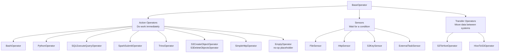
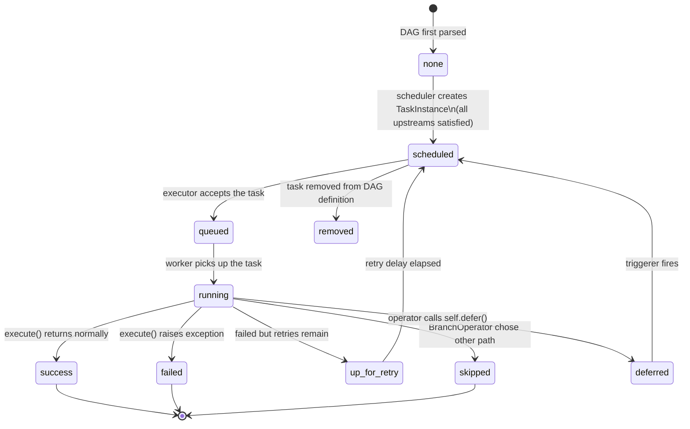

# Operators, Tasks, and Task Instances

## Conceptual Distinction

| Term | What it is |
|---|---|
| **Operator** | A class defining what to do (template) |
| **Task** | An operator instantiated inside a DAG (node in the graph) |
| **Task Instance** | A specific execution of a task for a given DagRun |

A `PythonOperator` is a class. When you instantiate it with `task_id="load"` inside a DAG, you have a task. When the scheduler runs that DAG on 2025-01-01, you have a task instance.

---

## Operator Taxonomy



---

## Authoring: Classic API vs TaskFlow API

### Classic API

```python
from airflow.providers.standard.operators.python import PythonOperator

def extract_fn(**context):
    return {"row_count": 1_000_000}

extract = PythonOperator(
    task_id="extract",
    python_callable=extract_fn,
)
```

> The `provide_context=True` kwarg you may see in older examples has been a no-op since Airflow 2.0 — `**context` is always provided. Drop it.

### TaskFlow API (Airflow 2.0+, preferred in 3.x)

```python
from airflow.sdk import task

@task
def extract() -> dict:
    return {"row_count": 1_000_000}

@task
def transform(stats: dict) -> str:
    return f"Rows: {stats['row_count']}"

# Wiring — return values automatically become XComs
result = extract()
transform(result)
```

The `@task` decorator wraps the function in a `PythonOperator`, auto-generates `task_id` from the function name, and wires XCom push/pull transparently when you pass return values between tasks. It is the idiomatic style for Python-heavy pipelines in Airflow 3.x.

#### TaskFlow gotchas

- **Both positional and keyword arguments are wired.** Passing an upstream task's output by keyword (`transform(stats=extract())`) is supported and equivalent to passing it positionally.
- **Return-type hints do not drive XCom serialization.** XComs are JSON-serialized; if you annotate `-> SomeClass`, Airflow doesn't honor it — make sure your return is JSON-compatible.
- **Reuse a `@task` function as multiple nodes** with `.override(task_id="...")`:
  ```python
  ingest_a = ingest.override(task_id="ingest_events")(table="events")
  ingest_b = ingest.override(task_id="ingest_users")(table="users")
  ```

---

## Task Instance State Machine



### States Reference

| State | Meaning |
|---|---|
| `none` | TaskInstance exists in DB but hasn't been evaluated |
| `scheduled` | Eligible to run; awaiting executor pickup |
| `queued` | Sent to executor, awaiting worker |
| `running` | Worker is actively executing |
| `success` | Completed without exception |
| `failed` | Raised an unhandled exception, retries exhausted |
| `up_for_retry` | Failed, retry scheduled |
| `up_for_reschedule` | Sensor in reschedule mode, waiting for next poke |
| `skipped` | Explicitly skipped (branch, short-circuit) |
| `deferred` | Waiting for an async trigger |
| `removed` | Task was deleted from the DAG definition |
| `upstream_failed` | Upstream task failed; this task will not run |

---

## BaseOperator — Key Parameters

Every operator inherits these:

```python
PythonOperator(
    task_id="my_task",              # unique within the DAG
    dag=dag,                        # inferred if inside `with DAG(...)` context
    owner="data-engineering",
    retries=3,
    retry_delay=timedelta(minutes=5),
    retry_exponential_backoff=True,
    max_retry_delay=timedelta(hours=1),
    execution_timeout=timedelta(hours=2),   # hard wall-clock limit — task is killed on overrun
    sla=timedelta(hours=4),                 # SLA miss fires `sla_miss_callback` only; task is NOT killed
                                            # (Airflow 3.x: this mechanism is being superseded by Deadlines)
    on_failure_callback=alert_slack,
    on_success_callback=log_metrics,
    on_retry_callback=notify_oncall,
    depends_on_past=False,                  # block if previous run failed
    wait_for_downstream=False,
    pool="default_pool",                    # resource pool slot
    pool_slots=1,                           # WARNING: pool_slots > pool capacity = deadlock in 'scheduled'
    priority_weight=1,
    queue="default",                        # Celery queue routing
    trigger_rule="all_success",             # see dependencies.md
)
```

---

## Sensors

Sensors are operators that **wait for a condition** before allowing downstream tasks to proceed.

### Poke Mode (default)

The worker holds the task in `running` state and calls `poke()` on an interval. Simple but occupies a worker slot for the entire wait duration.

```python
from airflow.providers.amazon.aws.sensors.s3 import S3KeySensor

wait_for_data = S3KeySensor(
    task_id="wait_for_data",
    bucket_name="lakehouse",
    bucket_key="raw/events/dt={{ ds }}/_SUCCESS",
    aws_conn_id="aws_default",
    poke_interval=60,       # check every 60s
    timeout=3600,           # fail after 1h
    mode="poke",
)
```

### Reschedule Mode

The task enters `up_for_reschedule` between pokes, freeing the worker slot. Use for long waits (hours).

```python
wait_for_data = S3KeySensor(
    ...,
    mode="reschedule",      # releases worker slot between pokes
    poke_interval=300,
)
```

### Deferrable Mode (Airflow 2.2+)

The sensor yields a `Trigger` object instead of polling. The `airflow-triggerer` process awaits the trigger using `asyncio`; when the condition fires, the scheduler resumes the task by calling its `method_name` callback. The task instance occupies no worker slot during the wait, so a single triggerer can manage thousands of concurrent waits. Distinct from `mode="reschedule"`, which still consumes the scheduler/queue cycle for each poke.

In Airflow 3.x the canonical pattern is `deferrable=True` on the regular sensor — the standalone `S3KeySensorAsync` class was deprecated and is no longer present in the `apache-airflow-providers-amazon` shipped with this image.

```python
from airflow.providers.amazon.aws.sensors.s3 import S3KeySensor

wait_for_data = S3KeySensor(
    task_id="wait_for_data",
    bucket_name="lakehouse",
    bucket_key="raw/events/dt={{ ds }}/_SUCCESS",
    aws_conn_id="aws_default",
    deferrable=True,
)
```

Requires `airflow-triggerer` to be running (it is in this project).

---

## Operators Relevant to This Project

### SparkSubmitOperator

Submits a Spark application to the cluster via the `spark_default` connection.

> Requires `apache-airflow-providers-apache-spark` (installed via [services/airflow/Dockerfile](../../services/airflow/Dockerfile)) **and** `spark-submit` + a JRE on the worker image (not installed by default — see the Dockerfile comments for the three options to enable execution).

```python
from airflow.providers.apache.spark.operators.spark_submit import SparkSubmitOperator

run_spark = SparkSubmitOperator(
    task_id="run_spark_job",
    application="/opt/airflow/dags/jobs/iceberg_compaction.py",
    conn_id="spark_default",           # spark://spark-master:7077
    application_args=["--table", "events", "--partition", "{{ ds }}"],
    conf={
        "spark.sql.extensions": "org.apache.iceberg.spark.extensions.IcebergSparkSessionExtensions",
        "spark.sql.catalog.nessie": "org.apache.iceberg.spark.SparkCatalog",
    },
    packages="org.apache.iceberg:iceberg-spark-runtime-3.5_2.12:1.5.0",
    total_executor_cores=8,
    executor_memory="4g",
    driver_memory="2g",
    verbose=True,
)
```

Provider package: `apache-airflow-providers-apache-spark`

### TrinoOperator / SQLExecuteQueryOperator

Executes SQL against Trino via the `trino_default` connection.

> Requires `apache-airflow-providers-trino` — installed via [services/airflow/Dockerfile](../../services/airflow/Dockerfile). Exercised by the reference DAG at [services/airflow/dags/lakehouse_smoke.py](../../services/airflow/dags/lakehouse_smoke.py).

```python
from airflow.providers.common.sql.operators.sql import SQLExecuteQueryOperator

compact_table = SQLExecuteQueryOperator(
    task_id="compact_events",
    conn_id="trino_default",           # trino://trino:8080/
    sql="""
        ALTER TABLE iceberg.lakehouse.events
        EXECUTE optimize(file_size_threshold => '128MB')
        WHERE dt = DATE '{{ ds }}'
    """,
)
```

Provider package: `apache-airflow-providers-trino`

### S3 Operators (aws_default → RustFS)

```python
from airflow.providers.amazon.aws.operators.s3 import (
    S3CreateObjectOperator,
    S3DeleteObjectsOperator,
    S3ListOperator,
)

# Upload a control file
upload_flag = S3CreateObjectOperator(
    task_id="upload_success_flag",
    s3_bucket="lakehouse",
    s3_key="raw/events/dt={{ ds }}/_SUCCESS",
    data=b"",
    aws_conn_id="aws_default",          # points to rustfs:9000
    replace=True,
)
```

Provider package: `apache-airflow-providers-amazon`

---

## Task Groups

TaskGroups are a UI and organizational construct — they do not change execution semantics but collapse related tasks in the graph view.

```python
from airflow.sdk import TaskGroup

with TaskGroup("extract", tooltip="Raw data extraction") as extract_group:
    ingest_events = PythonOperator(task_id="ingest_events", ...)
    ingest_users  = PythonOperator(task_id="ingest_users",  ...)

with TaskGroup("transform") as transform_group:
    run_spark = SparkSubmitOperator(task_id="run_spark", ...)

extract_group >> transform_group
```

---

## Pools

Pools enforce slot-based concurrency for shared resources (e.g., Spark cluster connections, Trino query slots).

```python
# Define via UI: Admin → Pools → "spark_pool" with 4 slots
run_spark = SparkSubmitOperator(
    task_id="run_spark",
    pool="spark_pool",      # max 4 concurrent Spark tasks
    pool_slots=2,           # this task consumes 2 slots (large job)
    ...
)
```

All tasks without an explicit `pool` use `default_pool` (128 slots by default, configurable).

---

## Removed in Airflow 3.x

- **`SubDagOperator`** — use `TaskGroup` instead. The semantics differ (TaskGroups are purely visual; SubDags spawned a separate DagRun), but TaskGroup handles all the use cases that aren't anti-patterns.
- **`schedule_interval` DAG kwarg** — use `schedule` (see [dags.md](dags.md)).
- **`execution_date` task-context key** — use `logical_date`.
- **`enable_xcom_pickling`** config — XCom is JSON-only in 3.x.
