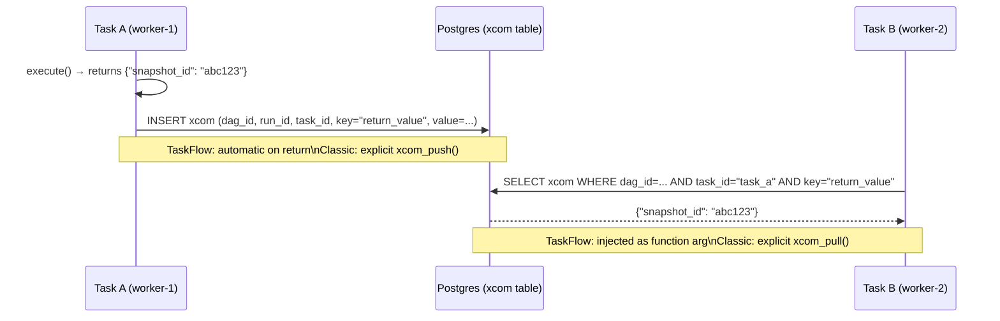

# XComs — Cross-Task Communication

XCom (Cross-Communication) is Airflow's mechanism for passing small values between tasks within the same DagRun. XCom values are stored in the metadata database and retrieved by downstream tasks by key.

## Serialization in Airflow 3.x

XCom values are **JSON-serialized**. Anything you return from a task or push via `xcom_push` must be JSON-serializable (`dict`, `list`, `str`, `int`, `float`, `bool`, `None`). Non-JSON-serializable returns (DataFrames, datetimes without `default=str`, sets, custom classes without `__dict__` conversion) raise at push time.

The legacy `enable_xcom_pickling` toggle from Airflow 2.x has been removed in 3.x — pickling is no longer an option. If you need pickle semantics, write a custom XCom backend.

Note: the `BaseXCom` class moved to `airflow.sdk.bases.xcom` in 3.x. The old `airflow.models.xcom` import path is deprecated and emits a `DeprecatedImportWarning`.

---

## How XComs Work



XComs are scoped to a **DagRun** — task B in run `2025-01-01` can only pull XComs from run `2025-01-01`. Cross-run XCom access requires explicit `run_id` targeting, which is an anti-pattern: even when you do it, `airflow db clean` can yank the source XCom out from under you, breaking dependencies silently.

### Silent failure modes

`xcom_pull` for a missing key returns `None` rather than raising. A typo in `task_ids=` or `key=` won't fail loudly — downstream code receives `None` and may misbehave. Validate explicitly when correctness matters:

```python
val = ti.xcom_pull(task_ids="extract", key="snapshot_id")
if val is None:
    raise ValueError("missing upstream XCom 'snapshot_id'")
```

### TaskFlow `multiple_outputs=True`

When a `@task` function returns a `dict` and is decorated with `multiple_outputs=True`, each top-level key is pushed as a separate XCom. Downstream tasks can depend on individual outputs rather than pulling the whole dict.

```python
@task(multiple_outputs=True)
def extract() -> dict:
    return {"snapshot_id": "snap_x", "row_count": 42}

@task
def use(snapshot_id: str, row_count: int): ...

result = extract()
use(snapshot_id=result["snapshot_id"], row_count=result["row_count"])
```

---

## TaskFlow API — Implicit XComs

The preferred approach in Airflow 3.x. Return values are automatically pushed as XComs; passing them as function arguments automatically pulls them.

```python
from airflow.sdk import task, DAG
from datetime import datetime

with DAG("iceberg_ingest", schedule="@daily", start_date=datetime(2025, 1, 1)) as dag:

    @task
    def extract_snapshot() -> dict:
        # return value → pushed as xcom key="return_value"
        return {
            "snapshot_id": "snap_20250101",
            "row_count": 1_500_000,
            "size_bytes": 2_147_483_648,
        }

    @task
    def validate_snapshot(snapshot: dict) -> bool:
        # `snapshot` arg → pulled from extract_snapshot's return_value XCom
        assert snapshot["row_count"] > 0
        return True

    @task
    def compact_table(snapshot: dict, is_valid: bool) -> str:
        if not is_valid:
            raise ValueError("Snapshot validation failed")
        return f"compacted:{snapshot['snapshot_id']}"

    snap = extract_snapshot()
    valid = validate_snapshot(snap)
    compact_table(snap, valid)
```

The DAG wiring (`snap`, `valid`) infers both the task dependency **and** the XCom pull. There is no explicit `xcom_push` or `xcom_pull` call.

---

## Classic API — Explicit XComs

```python
def extract_fn(ti, **context):
    snapshot_id = run_query()
    # explicit push — can push multiple keys
    ti.xcom_push(key="snapshot_id", value=snapshot_id)
    ti.xcom_push(key="row_count", value=1_500_000)
    # returning a value also pushes as key="return_value"
    return snapshot_id

def transform_fn(ti, **context):
    # explicit pull
    snapshot_id = ti.xcom_pull(task_ids="extract", key="snapshot_id")
    row_count = ti.xcom_pull(task_ids="extract", key="row_count")
    ...

extract = PythonOperator(task_id="extract", python_callable=extract_fn)
transform = PythonOperator(task_id="transform", python_callable=transform_fn)
```

### xcom_pull Parameters

```python
ti.xcom_pull(
    task_ids="task_a",          # source task (str or list)
    key="return_value",         # default key
    dag_id=None,                # defaults to current DAG
    run_id=None,                # defaults to current DagRun
    map_indexes=None,           # for mapped tasks (see below)
)
```

---

## XComs in Jinja Templates

SQL operators and BashOperator support XCom access via Jinja:

```python
run_trino = SQLExecuteQueryOperator(
    task_id="run_trino",
    conn_id="trino_default",
    sql="""
        SELECT * FROM iceberg.lakehouse.events
        WHERE snapshot_id = '{{ ti.xcom_pull(task_ids="extract", key="snapshot_id") }}'
    """,
)
```

---

## XCom with Mapped Tasks

When using dynamic task mapping, each task instance pushes its own XCom keyed by `map_index`. Downstream tasks can pull all values as a list or pull a specific index.

```python
@task
def process_partition(partition: str) -> int:
    return count_rows(partition)

@task
def aggregate(counts: list[int]) -> int:
    return sum(counts)

partitions = ["dt=2025-01-01", "dt=2025-01-02", "dt=2025-01-03"]
counts = process_partition.expand(partition=partitions)  # creates 3 mapped instances
aggregate(counts)  # receives [count_0, count_1, count_2]
```

---

## Size Limits and the Anti-Pattern

**Keep each XCom payload to a few KB.** XComs are not a data-transfer mechanism — they are for metadata and small control values. Storing MBs in XCom floods the metadata DB, slows JSON serialization, and bloats the `xcom` table to the point that DB cleanup becomes a recurring chore.

(The hard backend limits are large — Postgres `bytea` is technically capped at ~1 GB and SQLite at ~2 GB — but you will hit serialization and query-performance walls long before then.)

**What belongs in XCom:**
- Snapshot IDs, table names, partition specs
- Row counts, byte sizes, status flags
- File paths or S3 keys (not file contents)
- Query result sets of a few dozen rows maximum

**What does not belong in XCom:**
- DataFrames, Arrow tables, Spark DataFrames
- Large JSON/CSV payloads
- Binary files

For larger payloads, write to S3/RustFS and pass the path via XCom:

```python
@task
def extract() -> str:
    df = run_heavy_query()
    path = "s3://lakehouse/tmp/extract_{{ run_id }}.parquet"
    df.to_parquet(path)
    return path  # XCom carries only the S3 path

@task
def transform(input_path: str) -> str:
    df = pd.read_parquet(input_path)
    output_path = input_path.replace("/tmp/", "/clean/")
    df.to_parquet(output_path)
    return output_path
```

---

## Custom XCom Backends

The default XCom backend stores JSON-serialized values in the metadata DB. You can replace it globally (no per-DAG override) via `AIRFLOW__CORE__XCOM_BACKEND`, pointing at a class that subclasses `airflow.sdk.bases.xcom.BaseXCom` and implements `serialize_value` / `deserialize_value`. A common pattern is to spill large values to object storage and keep only the URI in the metadata DB.

The Apache Airflow project does not ship a ready-made S3 XCom backend at the Airflow 3.2 / amazon-provider 9.x level we run; building one is straightforward but out of scope here. If you adopt one, point it at `aws_default` so it inherits the RustFS endpoint override.

---

## XCom Cleanup

XComs accumulate over time. The `airflow db clean` command (Airflow 2.4+/3.x) purges old XComs and task instance records:

```bash
# Remove data older than 30 days
airflow db clean --clean-before-timestamp "$(date -d '30 days ago' --iso-8601=seconds)" \
  --tables xcom,task_instance,dag_run
```

Schedule this as a periodic Airflow DAG, a cron job inside the scheduler container, or an external cron. There is no built-in always-on cleanup DAG in 3.x — retention is opt-in.

---

## XCom Best Practices for This Project

| Scenario | What to pass via XCom |
|---|---|
| Iceberg table write | Snapshot ID (`long`), committed manifest path (`str`) |
| Spark job completion | Output table name, partition spec, row count |
| Trino query | Rows affected (`int`), last modified timestamp |
| S3/RustFS write | Object key or S3 URI of the written file |
| Validation check | Boolean pass/fail, threshold delta (`float`) |
| Large intermediate data | Write to `s3://lakehouse/tmp/...`, pass the path |
