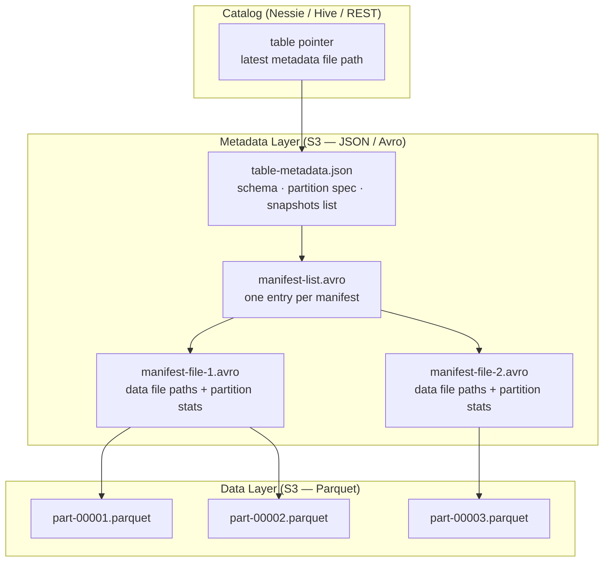
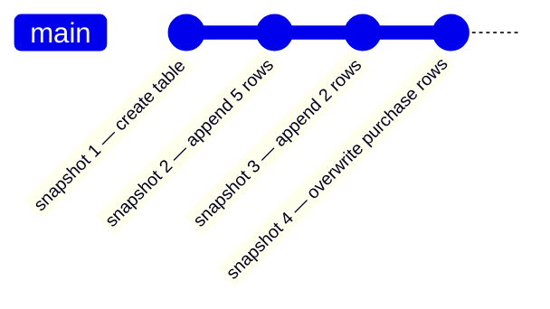
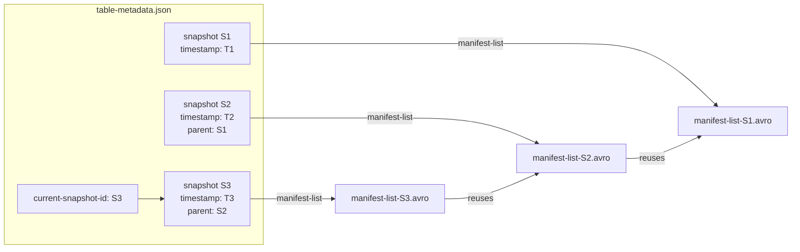
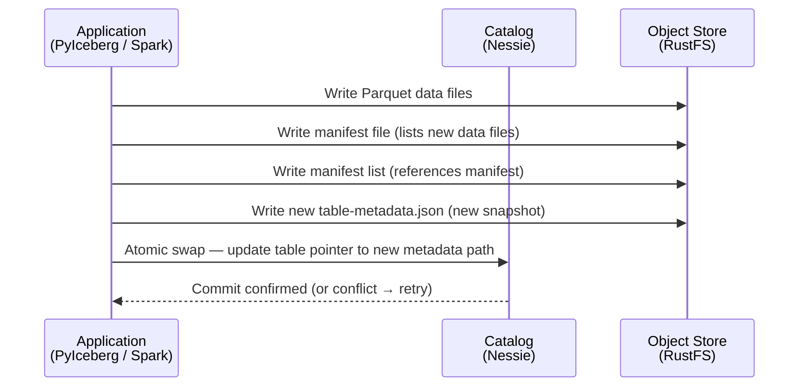
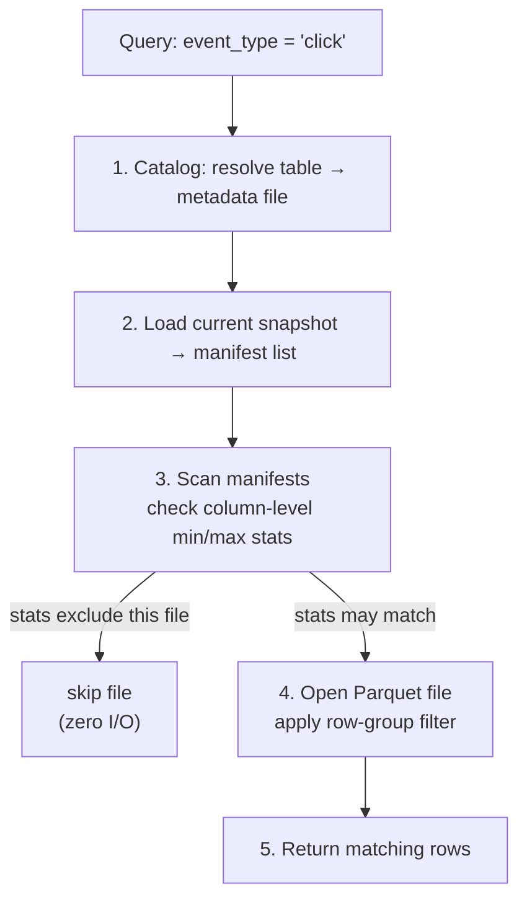
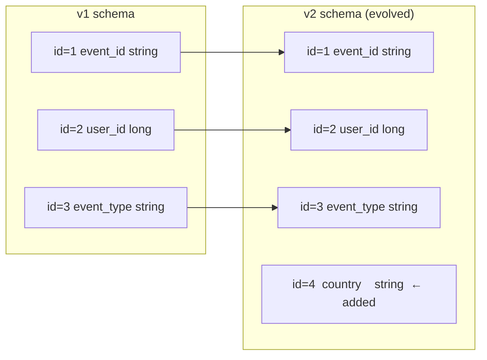
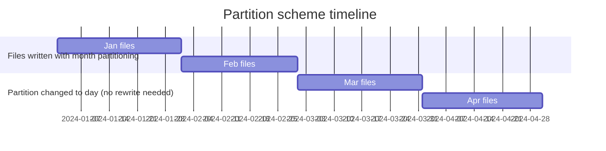
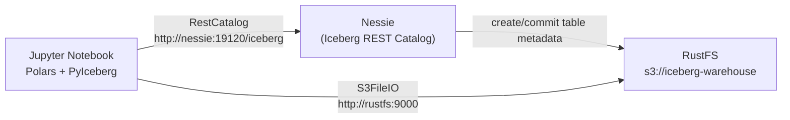

# Apache Iceberg — Architecture

## What Is Iceberg?

Apache Iceberg is an open **table format** for large analytic datasets. It is not a storage engine and not a query engine — it is a specification that sits between your object store (RustFS / S3) and your query tools (Spark, Trino, PyIceberg, DuckDB).

Iceberg solves problems that Hive-partitioned tables cannot:

| Problem | Hive tables | Iceberg |
|---|---|---|
| Concurrent writes | No isolation | Full ACID via optimistic concurrency |
| Schema changes | Break existing queries | Safe evolution (add, rename, reorder, widen) |
| Partition changes | Requires full rewrite | Partition evolution — old and new files coexist |
| Time travel | Not possible | Every snapshot is retained and queryable |
| Large directories | `LIST` calls are slow | Manifest files skip entire partitions |

---

## Three-Layer Architecture

Every Iceberg table is made of three distinct layers. The catalog only holds a single pointer — all structure lives in files on object storage.

### Layer responsibilities

| Layer | Files | Purpose |
|---|---|---|
| **Catalog** | In-memory pointer | Maps `namespace.table` → current metadata file path |
| **Table metadata** | `metadata/*.json` | Schema, partition spec, list of all snapshots |
| **Manifest list** | `metadata/*.avro` | One row per manifest; created per snapshot |
| **Manifest file** | `metadata/*.avro` | One row per data file; stores min/max stats for partition pruning |
| **Data files** | `data/*.parquet` | Actual rows; immutable once written |

---

## Snapshot Model

Every write (append, overwrite, delete) creates a new **snapshot**. Previous snapshots are never mutated — this is what enables ACID, time travel, and concurrent reads without locks.

Manifests are **reused across snapshots** — only the delta (new files) gets a new manifest. This makes snapshot creation O(new files), not O(total files).

---

## Write Flow

The catalog's **atomic swap** is the only coordination point. Writers never lock data files — they race only on the metadata pointer. If two writers commit concurrently, the second one detects the conflict and retries from the new base snapshot.

---

## Read Flow — Predicate Pushdown

Iceberg skips data files before opening them using statistics stored in manifest files.

Two levels of pruning:
1. **Manifest-level**: skip entire manifests if partition range excludes the predicate.
2. **Row-group-level**: Parquet column statistics skip row groups within a file.

---

## Schema Evolution

Iceberg tracks fields by **ID**, not by name or position. Renaming or reordering a column never breaks readers that were compiled against the old schema.

Old Parquet files (written without `country`) are read as `null` for that field — no migration needed.

---

## Partition Evolution

In Hive, changing the partition scheme means rewriting every file. In Iceberg, old and new partition schemes coexist — each manifest records which scheme its files use.

---

## In This Lakehouse

- **PyIceberg** handles the Iceberg protocol client-side.
- **Nessie** is the catalog — tracks the table pointer and enforces atomic commits.
- **RustFS** stores all files (Parquet data files + JSON/Avro metadata files) in the `iceberg-warehouse` bucket.
