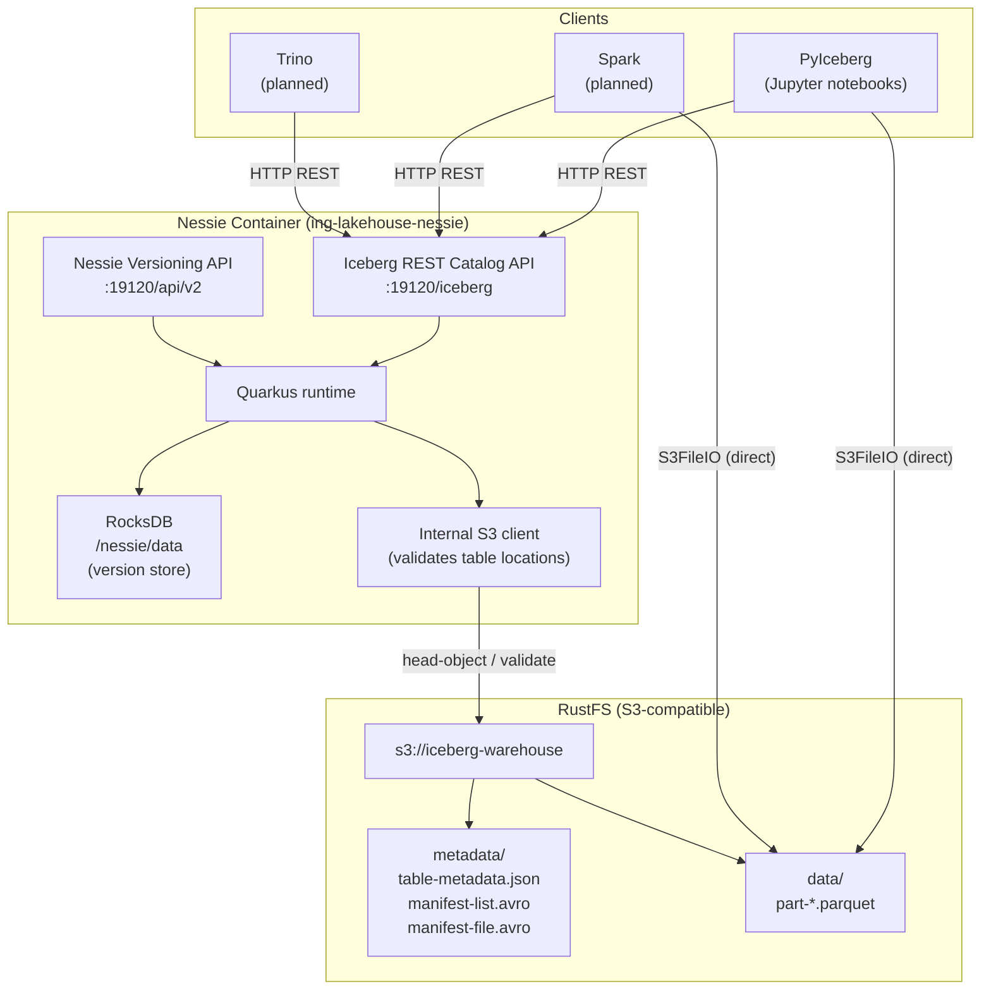
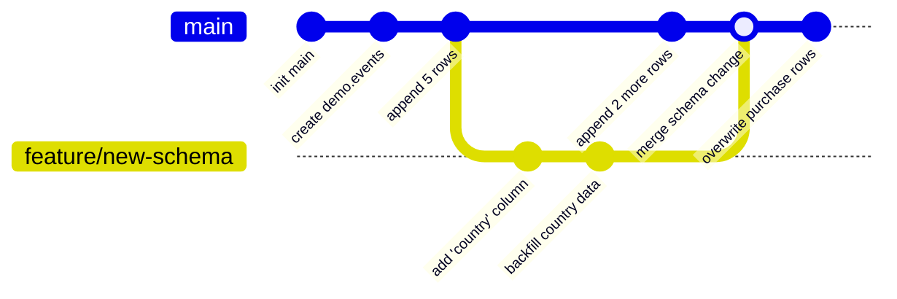
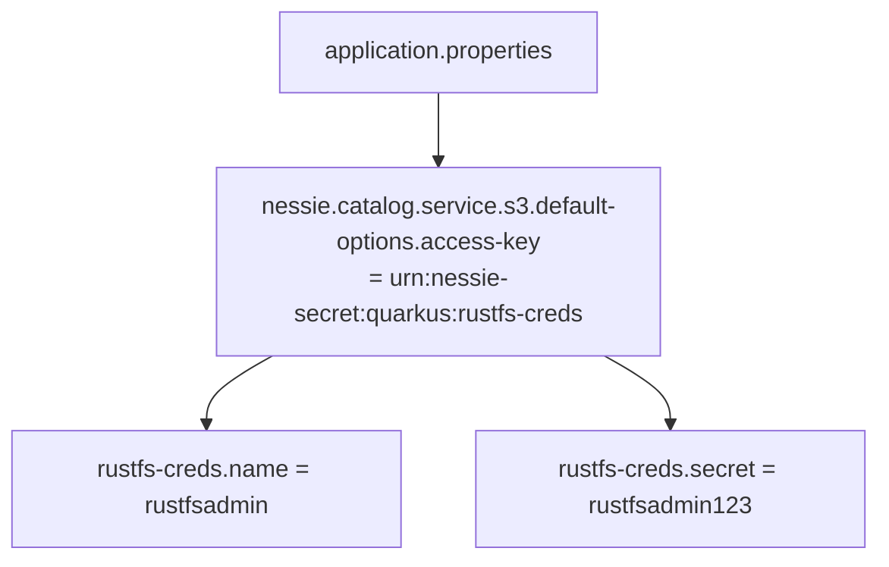
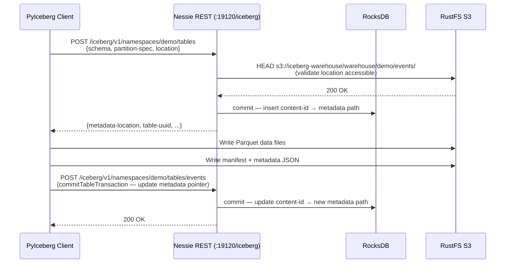
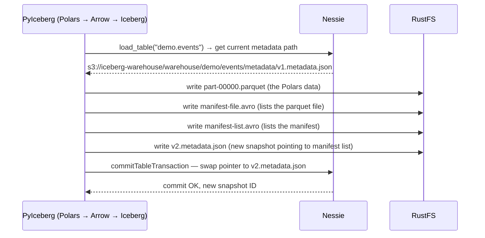
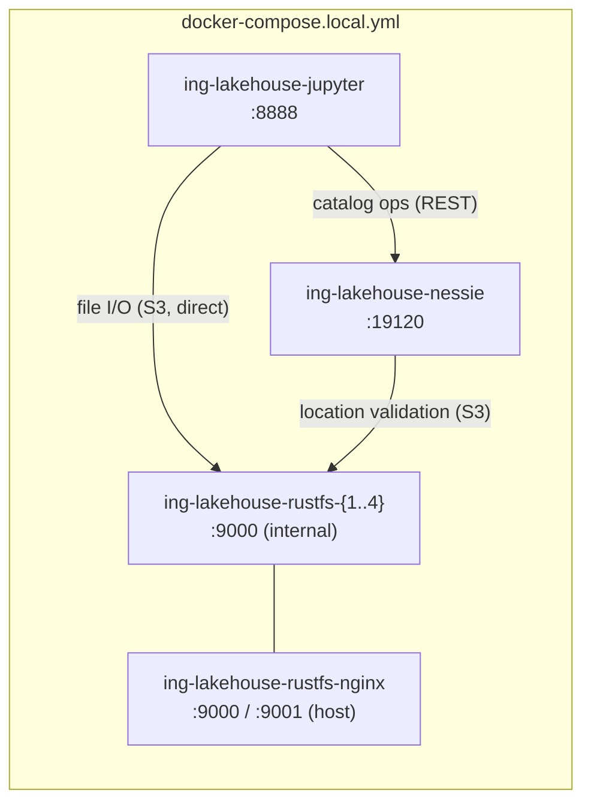

# Project Nessie — Architecture

## What Is Nessie?

Project Nessie is a **versioned catalog** for data lakes. It implements the Apache Iceberg REST Catalog specification and adds a Git-like branching model on top — every table operation (create, drop, append, overwrite) is a commit on a branch.

Nessie is not a storage engine. It stores only metadata pointers (which metadata file a table currently points to). All actual data and Iceberg metadata files live in object storage (RustFS).

### Why Nessie instead of Hive Metastore?

| Concern | Hive Metastore | Nessie |
|---|---|---|
| External database | Requires PostgreSQL / MySQL | Embedded RocksDB — zero sidecar |
| Container startup | ~60s (Thrift server + DB migrations) | ~10s |
| Iceberg REST Catalog spec | Third-party adapters needed | First-class, built-in |
| Data branching | Not supported | Native (Git-style) |
| Spark / Trino / PyIceberg support | Yes | Yes |
| Time travel across tables | Not supported | Cross-table consistent snapshots |

---

## High-Level Architecture



> Clients talk to Nessie only for **catalog operations** (create table, commit, load table metadata path). All actual file I/O (reading/writing Parquet) goes directly to RustFS — Nessie is never in the data path.

---

## Internal Components

### Quarkus Runtime

Nessie is built on [Quarkus](https://quarkus.io/) (the "Supersonic Subatomic Java" framework). Configuration is read from `/deployments/config/application.properties` at startup — this is the standard Quarkus SmallRye Config location.

```mermaid
graph LR
    subgraph Config sources (priority high → low)
        ENV["Environment variables<br/>(QUARKUS_HTTP_PORT etc.)"]
        FILE["application.properties<br/>(/deployments/config/)"]
        JAR["Built-in defaults<br/>(inside nessie-quarkus.jar)"]
    end
    ENV --> FILE --> JAR
```

### Version Store (RocksDB)

The version store is Nessie's database. It stores:
- Branch / tag refs and their HEAD commit hashes
- The full commit history (each commit = a content change on one or more tables)
- Per-table content IDs and their current metadata file paths

RocksDB is embedded — no network connection, no separate process. Data persists in the Docker volume at `/nessie/data`.

### Iceberg REST Catalog Endpoint

Nessie exposes the [Iceberg REST Catalog specification](https://iceberg.apache.org/docs/latest/rest-catalog/) at `/iceberg`. PyIceberg's `RestCatalog` speaks this protocol natively.

---

## Nessie Commit Model

Every table change is a **Nessie commit** on a branch. This is the key difference from a plain Iceberg REST catalog:



- `main` is the default branch.
- You can create a feature branch, make table changes on it (schema evolution, data writes), and merge to `main` atomically — all without affecting readers on `main`.
- Tags are immutable snapshots of branch state — useful for marking a release or a reporting cutoff.

---

## Credential Configuration

Nessie's internal S3 client (used for validating table locations and writing catalog-side metadata) uses **Quarkus-native URN secrets**, not standard `AWS_*` environment variables.



The `urn:nessie-secret:quarkus:<prefix>` syntax tells Nessie's secret resolver to look for `<prefix>.name` and `<prefix>.secret` keys in the same config file. This is the format documented in Nessie's own built-in `application.properties` (inside the JAR).

Standard `AWS_ACCESS_KEY_ID` / `AWS_SECRET_ACCESS_KEY` env vars are **not** picked up by Nessie's catalog S3 client.

---

## Request Flow — Table Creation



---

## Request Flow — Table Append (from Notebook 01)



---

## Ports and Endpoints

| Port | Interface | Key paths |
|---|---|---|
| `19120` | Main HTTP (Quarkus) | `/iceberg` — Iceberg REST Catalog · `/api/v2` — Nessie versioning API |
| `9001` | Management (Quarkus) | `/q/health/live` · `/q/health/ready` · `/q/metrics` |

The management port is separate so that health probes never compete with catalog traffic.

---

## In This Lakehouse



> Jupyter connects to `http://rustfs:9000` (direct container, no TLS) rather than `http://ing-lakehouse-rustfs-nginx:9000`. The nginx proxy uses a self-signed certificate for external HTTPS — bypassing it for intra-cluster traffic avoids SSL trust issues.

---

## First-Run Checklist

```bash
make up                  # starts nessie + jupyter (jupyter waits for nessie healthy)
make nessie-init-bucket  # creates iceberg-warehouse bucket in RustFS (one-time)
make health              # verify ing-lakehouse-nessie shows (healthy)
# open http://localhost:8888?token=lakehouse
# run notebooks in order: 00 → 01 → 02
```
