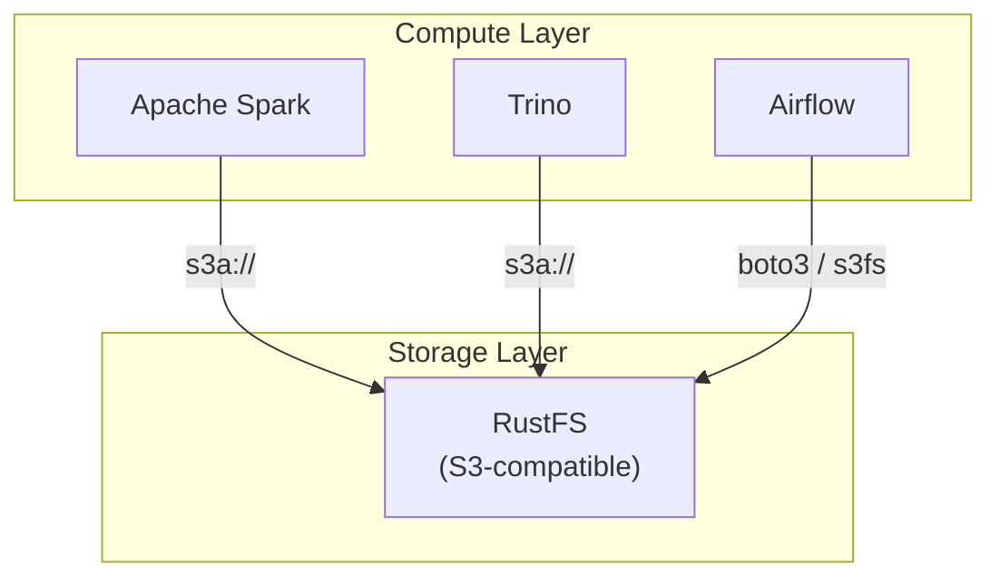
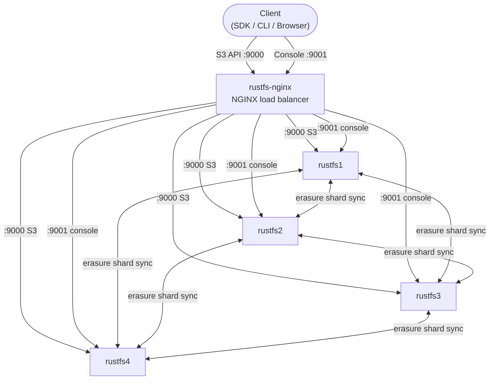
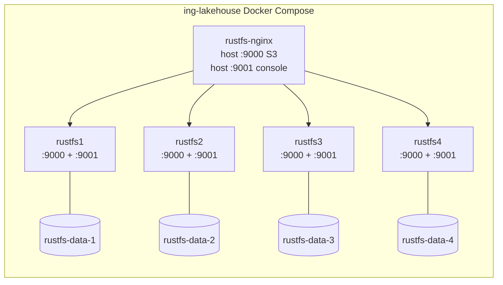
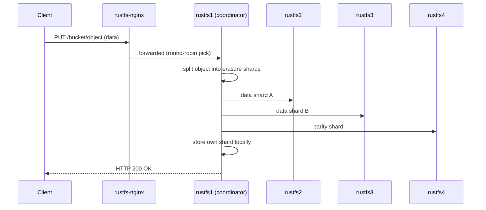
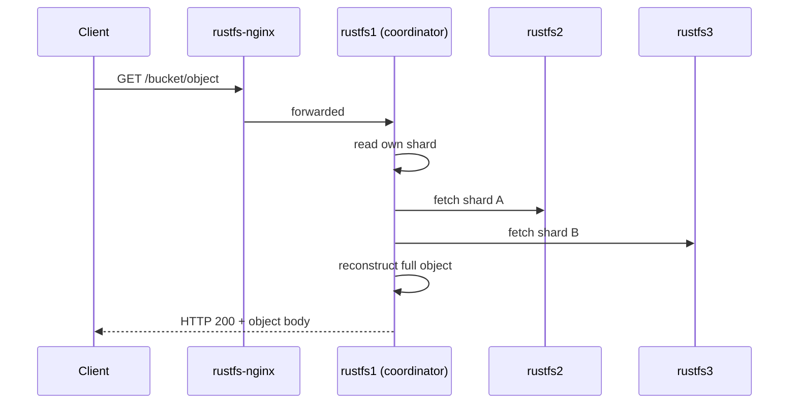

# RustFS — Architecture

RustFS is a high-performance, S3-compatible distributed object storage system written in Rust. It is Apache 2.0-licensed, has no telemetry, and benchmarks at ~2.3× the throughput of MinIO on small objects.

---

## How It Fits in the Lakehouse

RustFS acts as the **storage layer**: every other service (Spark, Trino, Hive, Airflow) reads and writes data through the S3 API. Think of it as the lakehouse's hard drive — everything else is compute on top of it.

---

## High-Level Architecture

Our deployment runs **4 RustFS nodes** behind an **NGINX load balancer**. NGINX is the single entry point for both traffic types:

- **Port 9000** — S3 API, round-robined across all 4 nodes
- **Port 9001** — Web console, round-robined across all 4 nodes (each node runs its own console process)

This means the console remains reachable even if any individual node goes down — NGINX simply skips the unhealthy backend and picks the next one.

---

## Docker Compose Service Map

Each service container is attached to the shared `lakehouse-net` Docker network. Named volumes ensure data persists across restarts.

---

## Write Path (PUT object)

When a client uploads an object, the receiving node handles erasure coding and distributes shards to its peers before acknowledging the client.

---

## Read Path (GET object)

Any node can serve a read. If one node is unavailable, the coordinator reconstructs the object from the surviving shards using the parity data.

---

## Fault Tolerance

With 4 nodes using RS(2,2) erasure coding:

| Nodes failed | Cluster status |
| --- | --- |
| 0 | Fully operational |
| 1 | Fully operational (degraded) |
| 2 | Fully operational (degraded) |
| 3 | **Cluster unavailable** |
| 4 | **Cluster unavailable** |

The cluster can survive the simultaneous loss of any **2 nodes** while continuing to serve reads and writes.

---

## Component Responsibilities

| Component | Role |
| --- | --- |
| `rustfs-nginx` | Single entry point — load-balances both S3 API (:9000) and web console (:9001) across all nodes; logs each request with the upstream node address via `$upstream_addr` |
| `rustfs1–4` | Data nodes — each runs the S3 API and a console process; NGINX picks any healthy node for either traffic type |
| `lakehouse-net` | Shared Docker network for cross-service communication |
| Named volumes | Persistent data storage, one volume per node |

---

## Configuration Reference

Key environment variables (set in root `.env`):

| Variable | Description |
| --- | --- |
| `RUSTFS_ACCESS_KEY` | S3 root access key |
| `RUSTFS_SECRET_KEY` | S3 root secret key |
| `RUSTFS_VOLUMES` | Space-separated list of all node data endpoints |
| `RUSTFS_ADDRESS` | Bind address for S3 API (`0.0.0.0:9000`) |
| `RUSTFS_CONSOLE_ADDRESS` | Bind address for web console (`0.0.0.0:9001`) |
| `RUSTFS_OBS_LOGGER_LEVEL` | Log level: `debug`, `info`, `warn`, `error` |

---

## Further Reading

- [Erasure Coding in RustFS](erasure-coding.md)
- [RustFS GitHub](https://github.com/rustfs/rustfs)
- [RustFS Documentation](https://docs.rustfs.com)
