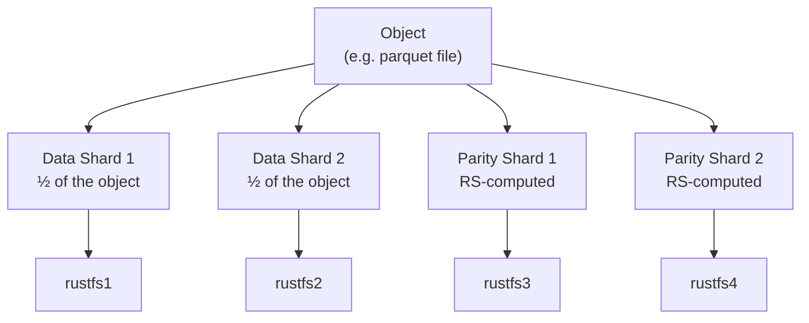
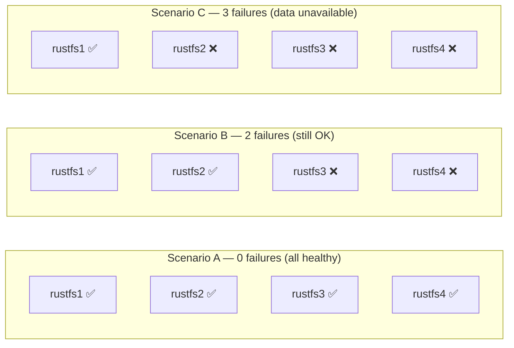

# Erasure Coding in RustFS

Erasure coding is the technique RustFS uses to protect your data from hardware failure — without wasting disk space on simple copies. This document explains how it works in plain language.

---

## The Problem with Plain Replication

The naive approach to fault tolerance is to keep multiple full copies of every file. With 3× replication across 4 nodes:

- You store **3 copies** of every object
- You can afford to lose any **1 node** and still read the data
- But you use **300%** of the raw storage capacity
- Only **33%** of your total disk space holds unique data

That's expensive.

---

## What Erasure Coding Does Instead

Erasure coding (EC) breaks an object into **k data pieces** and generates **m extra parity pieces** from them using Reed-Solomon mathematics. You can then reconstruct the original object from any **k** of the total **k + m** pieces — it doesn't matter which ones survive.

```text
Object (100 MB)
      │
      ▼
┌─────────────┐
│  Split into  │
│  k + m shards│
└─────────────┘
      │
      ├──── data shard 1  →  node 1
      ├──── data shard 2  →  node 2
      ├──── parity shard 1 → node 3
      └──── parity shard 2 → node 4
```

To read the object back, you only need any **k = 2** of the 4 shards. The math fills in the gaps.

---

## Our Setup: RS(2, 2)

In our 4-node Docker deployment, RustFS uses **RS(2, 2)**:

| Parameter | Value | Meaning |
| --- | --- | --- |
| `k` (data shards) | 2 | The object is split into 2 pieces |
| `m` (parity shards) | 2 | 2 extra recovery pieces are generated |
| Total nodes needed | k + m = 4 | Exactly our cluster size |
| Fault tolerance | m = **2 nodes** | Can survive any 2 simultaneous node failures |
| Storage efficiency | k / (k+m) = **50%** | Half your raw capacity holds unique data |

---

## Visualising the Shard Layout



If nodes 3 and 4 both fail simultaneously, the original object is still fully recoverable from the two surviving data shards on nodes 1 and 2.

---

## Failure Scenarios



Scenario C doesn't mean data is **lost** — once 2+ nodes come back online, everything is recoverable. Data is only permanently lost if more than `m` nodes fail **and** their disks are unrecoverable.

---

## Erasure Coding vs Replication

| Property | 3× Replication | RS(2, 2) Erasure Coding |
| --- | --- | --- |
| Raw storage used per 1 TB of data | 3 TB | 2 TB |
| Storage efficiency | 33% | **50%** |
| Max simultaneous node failures | 2 (of 3) | **2** (of 4) |
| Read performance | High (read from nearest) | High (read from any k nodes) |
| Write performance | Write to all replicas | Compute shards + write in parallel |
| Complexity | Simple | Moderate (math-based recovery) |

---

## How Reed-Solomon Works (in one paragraph)

Reed-Solomon treats the data shards as coefficients of a polynomial, evaluates that polynomial at `k + m` distinct points (one per shard), and stores the result. Given any `k` of those `k + m` (point, value) pairs, the original polynomial — and therefore the original data — can be recovered using Lagrange interpolation or Gaussian elimination. The math guarantees exact reconstruction regardless of which `k` shards survive.

---

## Reed-Solomon Explained Simply

### The core idea

Reed-Solomon is essentially: **draw a curve through your data, then store extra points on that curve as backups.**  
To recover, pick any enough points on the curve, redraw it, and read off the originals.

---

### The dot-connect analogy

Remember from school: **two points define exactly one straight line.**  
No matter which two points you give someone, they can always reconstruct the same line — and read any value off it.

Reed-Solomon is that idea, scaled up:

| k (data shards) | Curve shape | Points needed to redraw |
| --- | --- | --- |
| 1 | Horizontal line (degree 0) | Any 1 point |
| 2 | Straight line (degree 1) | Any 2 points |
| 3 | Parabola (degree 2) | Any 3 points |
| k | Polynomial of degree k−1 | Any k points |

For our **RS(2, 2)** setup, k = 2, so Reed-Solomon works with straight lines.

---

### Step-by-step walkthrough with real numbers

Let's trace through exactly what happens to a tiny piece of data.

#### Step 1 — The data

Pretend a chunk of your file boils down to two values:

```text
d₁ = 3   (will go on node 1)
d₂ = 5   (will go on node 2)
```

#### Step 2 — Build a polynomial

Treat d₁ as the value at x = 0, and d₂ as the value at x = 1.  
We want a line f(x) that passes through both points:

```text
f(0) = 3
f(1) = 5
```

Two points → one unique line.  
Slope = (5 − 3) / (1 − 0) = **2**, intercept = **3**

```text
f(x) = 3 + 2x
```

#### Step 3 — Compute the parity shards

Evaluate the line at two more x-values to get the parity shards:

```text
f(2) = 3 + 2×2 = 7   → parity shard 1 (node 3)
f(3) = 3 + 2×3 = 9   → parity shard 2 (node 4)
```

We now distribute **four values** across four nodes:

| Node | x | Stored value |
| --- | --- | --- |
| rustfs1 | 0 | **3** (data) |
| rustfs2 | 1 | **5** (data) |
| rustfs3 | 2 | **7** (parity) |
| rustfs4 | 3 | **9** (parity) |

#### Step 4 — Recovery after two node failures

Suppose rustfs1 and rustfs2 both crash. We only have:

```text
(x=2, value=7)   from node 3
(x=3, value=9)   from node 4
```

Two points still define exactly one line. Solve for a + bx:

```text
a + 2b = 7
a + 3b = 9
──────────
       b = 2   →   a = 7 − 4 = 3
```

We recover f(x) = 3 + 2x — the exact same line.  
Plug back in:

```text
f(0) = 3  ✅  d₁ restored
f(1) = 5  ✅  d₂ restored
```

Full data recovered from the two parity nodes alone.

---

### Why real RS uses finite fields (GF(2⁸))

The example above uses normal integers. That breaks down with real file data because:

- A real file chunk might be a number like 2,847,392 — and adding/multiplying big numbers produces even bigger numbers that overflow storage.
- Floating-point arithmetic introduces rounding errors, corrupting your data silently.

Reed-Solomon solves this by doing all arithmetic inside a **Galois field** (written GF(2⁸) for byte-sized values). Think of it as a special "clock arithmetic" where:

- Every byte value (0–255) stays a byte value after any operation — no overflow, ever.
- Addition and multiplication are redefined using XOR and lookup tables.
- The polynomial idea is **identical**; only the number system is different.

This keeps the math exact, fast, and byte-safe regardless of how big the file is.

---

> **Key insight**  
> Any k points uniquely determine a polynomial of degree k − 1.  
> That's why you always need exactly k surviving shards — no more, no less — to reconstruct the original data perfectly.

---

## Further Reading

- [RustFS Erasure Coding Docs](https://docs.rustfs.com/concepts/principle/erasure-coding.html)
- [Architecture Overview](architecture.md)
- [Wikipedia: Reed–Solomon error correction](https://en.wikipedia.org/wiki/Reed%E2%80%93Solomon_error_correction)
