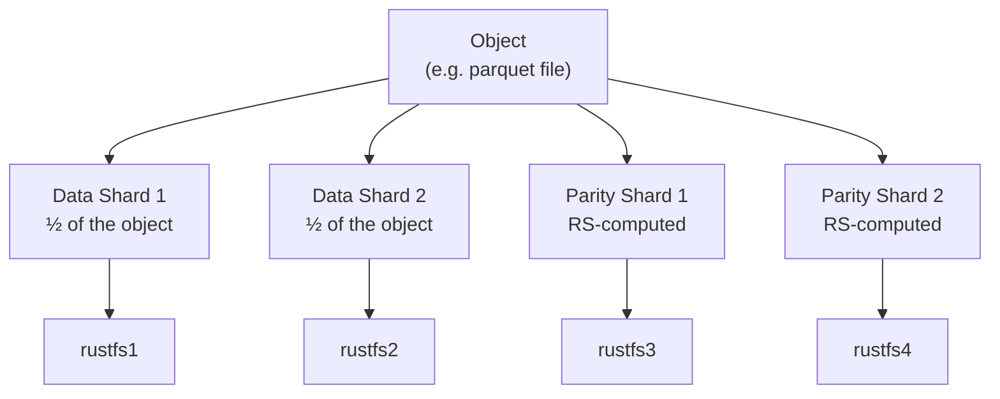
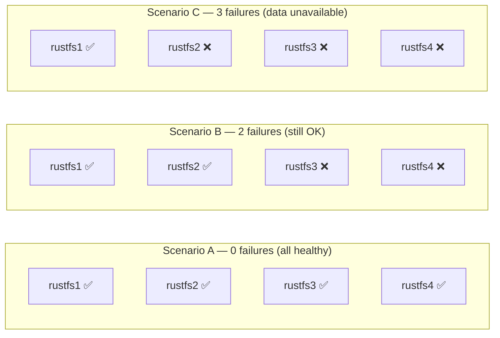

# Erasure Coding in RustFS

Erasure coding is the technique RustFS uses to protect your data from hardware failure — without wasting disk space on simple copies. This document explains how it works in plain language.

---

## The Problem with Plain Replication

The naive approach to fault tolerance is to keep multiple full copies of every file. With 3× replication across 4 nodes:

- You store **3 copies** of every object
- You can afford to lose any **1 node** and still read the data
- But you use **300%** of the raw storage capacity
- Only **33%** of your total disk space holds unique data

That's expensive.

---

## What Erasure Coding Does Instead

Erasure coding (EC) breaks an object into **k data pieces** and generates **m extra parity pieces** from them using Reed-Solomon mathematics. You can then reconstruct the original object from any **k** of the total **k + m** pieces — it doesn't matter which ones survive.

```
Object (100 MB)
      │
      ▼
┌─────────────┐
│  Split into  │
│  k + m shards│
└─────────────┘
      │
      ├──── data shard 1  →  node 1
      ├──── data shard 2  →  node 2
      ├──── parity shard 1 → node 3
      └──── parity shard 2 → node 4
```

To read the object back, you only need any **k = 2** of the 4 shards. The math fills in the gaps.

---

## Our Setup: RS(2, 2)

In our 4-node Docker deployment, RustFS uses **RS(2, 2)**:

| Parameter | Value | Meaning |
|---|---|---|
| `k` (data shards) | 2 | The object is split into 2 pieces |
| `m` (parity shards) | 2 | 2 extra recovery pieces are generated |
| Total nodes needed | k + m = 4 | Exactly our cluster size |
| Fault tolerance | m = **2 nodes** | Can survive any 2 simultaneous node failures |
| Storage efficiency | k / (k+m) = **50%** | Half your raw capacity holds unique data |

---

## Visualising the Shard Layout



If nodes 3 and 4 both fail simultaneously, the original object is still fully recoverable from the two surviving data shards on nodes 1 and 2.

---

## Failure Scenarios



Scenario C doesn't mean data is **lost** — once 2+ nodes come back online, everything is recoverable. Data is only permanently lost if more than `m` nodes fail **and** their disks are unrecoverable.

---

## Erasure Coding vs Replication

| Property | 3× Replication | RS(2, 2) Erasure Coding |
|---|---|---|
| Raw storage used per 1 TB of data | 3 TB | 2 TB |
| Storage efficiency | 33% | **50%** |
| Max simultaneous node failures | 2 (of 3) | **2** (of 4) |
| Read performance | High (read from nearest) | High (read from any k nodes) |
| Write performance | Write to all replicas | Compute shards + write in parallel |
| Complexity | Simple | Moderate (math-based recovery) |

---

## How Reed-Solomon Works (in one paragraph)

Reed-Solomon treats the data shards as coefficients of a polynomial, evaluates that polynomial at `k + m` distinct points (one per shard), and stores the result. Given any `k` of those `k + m` (point, value) pairs, the original polynomial — and therefore the original data — can be recovered using Lagrange interpolation or Gaussian elimination. The math guarantees exact reconstruction regardless of which `k` shards survive.

---

## Further Reading

- [RustFS Erasure Coding Docs](https://docs.rustfs.com/concepts/principle/erasure-coding.html)
- [Architecture Overview](architecture.md)
- [Wikipedia: Reed–Solomon error correction](https://en.wikipedia.org/wiki/Reed%E2%80%93Solomon_error_correction)
